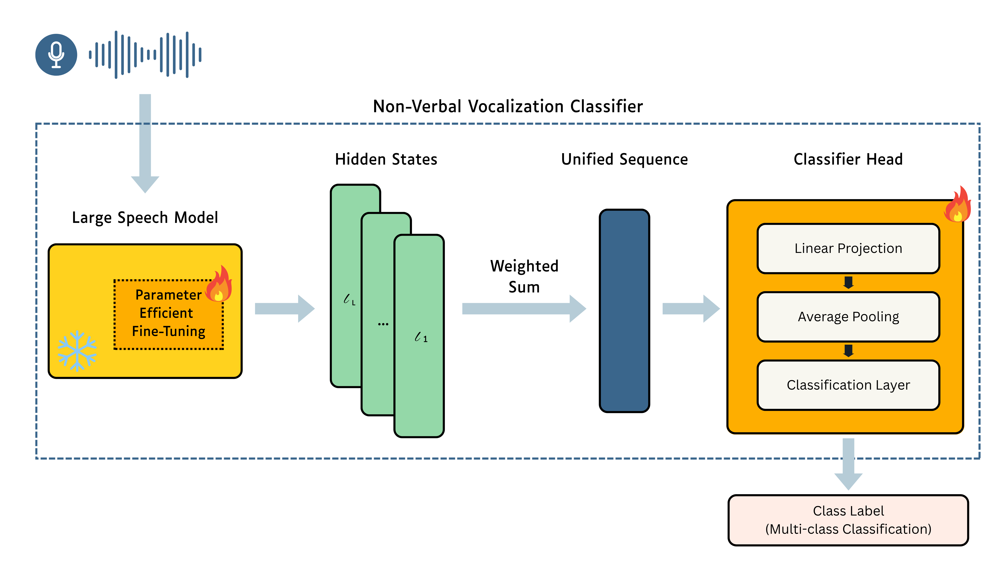

# Exploring the Adaptability of Large Speech Models to Non-Verbal Vocalization Tasks

This repository accompanies the paper **"Exploring the Adaptability of Large Speech Models to Non-Verbal Vocalization Tasks"**, which investigates how Large Speech Models (LSMs) can be adapted to recognize and process **Non-Verbal Vocalizations (NVVs)**—vocal bursts like laughter, sighs, screams, and moans.

## Overview

Large Speech Models such as **Wav2Vec 2.0**, **HuBERT**, **WavLM**, **UniSpeech**, and **Whisper** have proven highly effective on speech-centric tasks. However, their ability to generalize to non-verbal vocal cues remains largely unexplored.

In this work, we systematically study:
- The *pre-trained* knowledge of LSMs about NVVs using **linear probing**.
- The performance improvements from **Parameter-Efficient Fine-Tuning (PEFT)** techniques such as:
  - **LoRA** (Low-Rank Adaptation)
  - **Adapters**
  - **Prompt Tuning**

We conduct experiments across **five NVV datasets**:
- **ASVP-ESD** - Audio-Visual Speaker-Independent Emotion and Sentiment Dataset
- **CNVVE** - Chinese Non-Verbal Vocalization Emotion Dataset
- **Non-Verbal Vocalization Dataset** - General NVV classification dataset
- **ReCANVo** - Relational and Contextual Audio Non-Verbal Vocalizations
- **VIVAE** - Vocal Interactivity in-the-Wild Audio-Visual Emotion Dataset

## Model Architecture



Our framework implements a unified pipeline for adapting Large Speech Models to non-verbal vocalization tasks:

1. **Audio Input**: Raw audio waveforms are processed by the pre-trained LSM
2. **Parameter-Efficient Fine-Tuning**: PEFT methods (LoRA, Adapters, Prompt Tuning) are applied to specific layers
3. **Hidden State Extraction**: Layer-wise representations are extracted from the LSM backbone
4. **Weighted Aggregation**: A learnable weighted sum combines information across layers
5. **Unified Representation**: The aggregated features form a single sequence representation
6. **Classification Head**: A multi-layer classifier (Linear Projection + Average Pooling + Classification Layer) predicts the final class label

This architecture enables systematic analysis of which layers encode NVV-relevant information and how PEFT methods can effectively adapt pre-trained knowledge for non-verbal tasks.

## Key Results

- **Whisper** consistently outperforms other LSMs across all datasets.
- **LoRA** emerges as the most effective PEFT method.
- Non-verbal information is primarily encoded in **later layers** of Whisper.
- Surprisingly, **fine-tuning earlier, less informative layers** results in better adaptation than fine-tuning layers already rich in NVV knowledge.

## Contributions

1. **Benchmarking**: First systematic evaluation of LSMs on NVV tasks using five public datasets.
2. **Adaptation Techniques**: Comparison of PEFT methods (LoRA, Adapters, Prompt Tuning) for NVV modeling.
3. **Layer-wise Analysis**: Insights into which layers encode NVV-relevant features and how to adapt them effectively.

## Repository Structure

```
├── data/                           # Raw datasets for NVV classification
│   ├── asvp_esd/                  # ASVP-ESD dataset
│   ├── cnvve/                     # CNVVE dataset  
│   ├── nonverbal_vocalization_dataset/  # General NVV dataset
│   ├── recanvo/                   # ReCANVo dataset
│   └── vivae/                     # VIVAE dataset
├── src/non_verbal_voc_class/      # Main package source code
│   ├── configs/                   # Configuration management
│   ├── models/                    # LSM implementations and PEFT wrappers
│   │   ├── encoders/             # Audio encoder implementations
│   │   ├── whisper_classifier.py # Whisper-based classifier
│   │   ├── wav2vec2_classifier.py # Wav2Vec2-based classifier
│   │   ├── hubert_classifier.py  # HuBERT-based classifier
│   │   ├── wavlm_classifier.py   # WavLM-based classifier
│   │   └── unispeech_classifier.py # UniSpeech-based classifier
│   ├── preprocessing/             # Data preprocessing and loading
│   │   └── datasets/             # Dataset-specific preprocessing
│   └── training/                  # Training infrastructure
│       ├── collators/            # Data collation for batching
│       ├── evaluation.py         # Evaluation metrics and procedures
│       └── trainer.py            # Custom trainer implementations
├── experiments_configs/           # Experiment configuration files
│   ├── _base_/                   # Base configuration templates
│   ├── asvp_esd/                 # ASVP-ESD experiment configs
│   ├── cnvve/                    # CNVVE experiment configs
│   ├── nonverbal_vocalization_dataset/  # NVV dataset configs
│   ├── recanvo/                  # ReCANVo experiment configs
│   └── vivae/                    # VIVAE experiment configs
├── jobs/                          # Job scripts for cluster execution
├── examples/                      # Usage examples and tutorials
├── notebooks/                     # Jupyter notebooks for analysis
├── outputs/                       # Training outputs and results
├── logs/                         # Training logs and metrics
├── train.py                      # Main training script
└── requirements.txt              # Python dependencies
```

## Getting Started

### Requirements

- Python 3.10+
- PyTorch >= 2.0
- Transformers (HuggingFace) >= 4.40
- Additional dependencies listed in `requirements.txt`

### Installation

1. Clone the repository:
```bash
git clone https://github.com/links-ads/kk-nonverbal-vocal-class.git
cd kk-nonverbal-vocal-class
```

2. Install the package and dependencies:
```bash
pip install -r requirements.txt
pip install -e .
```

### Quick Start

1. **Basic Training Example** - Train a Whisper model with LoRA on ReCANVo dataset:
```bash
python train.py experiments_configs/recanvo/whisper_base_lora_012.py
```

2. **Custom Configuration** - Create your own experiment configuration by extending the base configs:
```python
# experiments_configs/custom/my_experiment.py
_base_ = [
    '../_base_/base_model.py',
    '../_base_/base_preprocessing.py', 
    '../_base_/base_training.py',
]

model_config = dict(
    model_type="whisper",
    audio_model_name="openai/whisper-base",
    finetune_method="lora",
    apply_adapter_to_layers=[0,1,2],
    num_labels=6,
)

preprocessing_config = dict(
    datasets_path="your_dataset/",
    audio_dataset_path="samples/",
    dataset_name="your_dataset",
)
```

3. **Evaluation** - Evaluate a trained model:
```python
from non_verbal_voc_class.models import ModelFactory
from non_verbal_voc_class.configs import Config

config = Config.from_file("path/to/config.py")
model = ModelFactory.create_model(config.model_config)
# Load checkpoint and evaluate
```

## Supported Models

| Model | Sizes | PEFT Support | Base Implementation |
|-------|-------|--------------|-------------------|
| **Whisper** | tiny, base, small | LoRA, Adapters, Prompt Tuning | `whisper_classifier.py` |
| **Wav2Vec2** | base | LoRA, Adapters | `wav2vec2_classifier.py` |
| **HuBERT** | base | LoRA, Adapters | `hubert_classifier.py` |
| **WavLM** | base | LoRA, Adapters | `wavlm_classifier.py` |
| **UniSpeech** | base | LoRA, Adapters | `unispeech_classifier.py` |

## Configuration System

The project uses a hierarchical configuration system with base configurations that can be extended:

- **Base Configs** (`experiments_configs/_base_/`):
  - `base_model.py` - Model architecture settings
  - `base_preprocessing.py` - Data preprocessing parameters  
  - `base_training.py` - Training hyperparameters

- **Dataset-Specific Configs** - Override base settings for each dataset
- **Experiment Configs** - Specific combinations of model + dataset + PEFT method

## Datasets

This project supports five public NVV datasets. Please refer to the individual dataset documentation for download and setup instructions:

| Dataset | Description | Labels | Reference |
|---------|-------------|--------|-----------|
| **ASVP-ESD** | Audio, Speech and Vision Processing Lab Emotional Sound Database | `boredom_sigh`, `neutral_calm`, `happy_laugh_gaggle`, `sad_cry`, `angry_grunt_frustration`, `fearful_scream_panic`, `disgust_dislike_contempt`, `surprised_gasp_amazed`, `excited`, `pleasure`, `pain_groan`, `disappointment_disapproval`, `breath` | [Kaggle](https://www.kaggle.com/datasets/dejolilandry/asvpesdspeech-nonspeech-emotional-utterances?resource=download) |
| **CNVVE** | The Dataset and Benchmark for Classifying Non-verbal Voice Expressions | `ahem`, `confirm`, `continuous`, `decline`, `hush`, `psst` | [Figshare](https://figshare.com/articles/dataset/CNVVE_Dataset_raw_audio_samples/23301665?file=41076086) |
| **Non-Verbal Vocalization Dataset** | General purpose NVV classification | `coughing`, `crying`, `laughing`, `lip-popping`, `lip-smacking`, `moaning`, `nose-blowing`, `panting`, `screaming`, `sighing`, `sneezing`, `teeth-chattering`, `teeth-grinding`, `throat-clearing`, `tongue-clicking`, `yawning` | [GitHub](https://github.com/deeplyinc/Nonverbal-Vocalization-Dataset) |
| **ReCANVo** | The Real-World Communicative and Affective Nonverbal Vocalizations | `selftalk`, `frustrated`, `delighted`, `dysregulated`, `social`, `request` | [Zenodo](https://zenodo.org/records/5786860) |
| **VIVAE** | The Variably Intense Vocalizations of Affect and Emotion | `achievement`, `anger`, `fear`, `pain`, `pleasure`, `surprise` | [Zenodo](https://zenodo.org/records/4066235) |

### Dataset Setup

1. Download the datasets and place them in the `data/` directory
2. Each dataset should follow this structure:
```
data/
├── dataset_name/
│   ├── samples/          # Audio files
│   ├── labels.csv        # Labels and metadata
│   └── README.md         # Dataset-specific documentation
```

3. Update the dataset paths in your experiment configuration files

## Project Architecture

### Core Components

- **Models** (`src/non_verbal_voc_class/models/`): LSM implementations with PEFT integration
- **Preprocessing** (`src/non_verbal_voc_class/preprocessing/`): Audio preprocessing and dataset loading
- **Training** (`src/non_verbal_voc_class/training/`): Training loop, metrics, and evaluation
- **Configs** (`src/non_verbal_voc_class/configs/`): Configuration management system

### PEFT Methods

The framework supports multiple Parameter-Efficient Fine-Tuning techniques:

- **LoRA** (Low-Rank Adaptation): Efficient adaptation via low-rank matrix decomposition
- **Adapters**: Lightweight modules inserted between transformer layers  
- **Prompt Tuning**: Learning soft prompts while keeping the model frozen

---

## Citation

If you find this repository useful in your research, please consider citing:

```bibtex
@misc{marquez2025exploring,
  title = {Exploring the Adaptability of Large Speech Models to Non-Verbal Vocalization Tasks},
  author = {Márquez Villacís, Juan José and D'Asaro, Federico and others},
  year = {2025},
}
```

## License

This project is licensed under the MIT License - see the [LICENSE](LICENSE) file for details.

## Contact

For questions, issues, or collaborations, please reach out:

- **Juan José Márquez Villacís**: [juan.marquez@linksfoundation.com](mailto:juan.marquez@linksfoundation.com)
- **Federico D'Asaro**: [federico.dasaro@linksfoundation.com](mailto:federico.dasaro@linksfoundation.com)

## Acknowledgments

This work was conducted at [LINKS Foundation](https://linksfoundation.com/) as part of research into adaptive speech processing technologies.